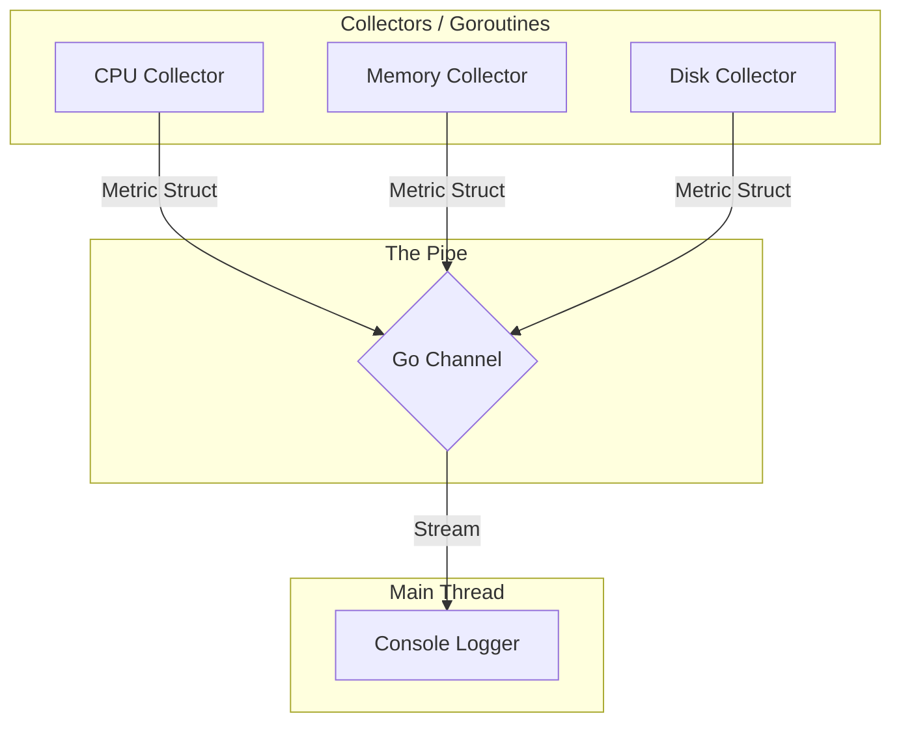

# Pulse-Agent

A high-performance, concurrent system monitoring agent built with Go. Pulse-Agent demonstrates the power of Go's native concurrency for real-time observability.

## Overview

Pulse-Agent is a lightweight heartbeat agent. It runs independent background workers that poll the operating system for hardware metrics and streams them through a central memory-pipe to a console-based consumer.

## Architecture

### Key Components

- **The Metric Model** -- A unified struct that defines the contract for all data points.
- **The Hub** -- A thread-safe Go Channel that prevents data races between collectors.
- **The Scheduler** -- A main loop utilizing `time.Ticker` for precise polling intervals.

## Requirements

- Go 1.21+
- Library: `github.com/shirou/gopsutil/v3`
