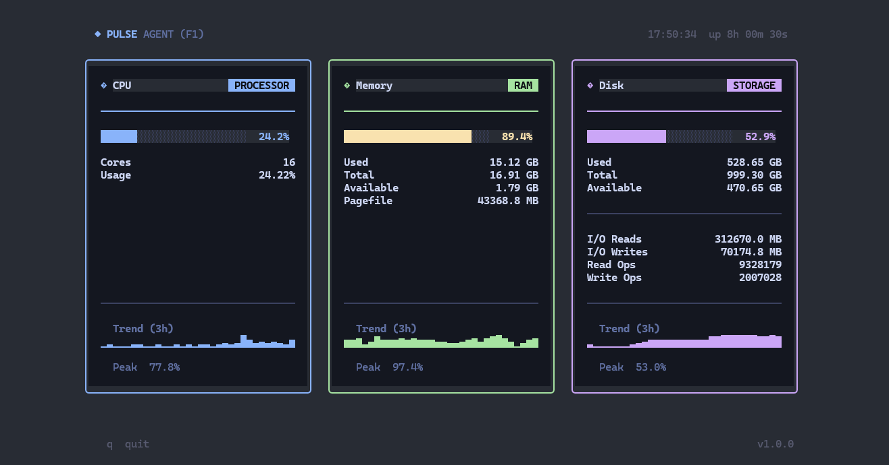
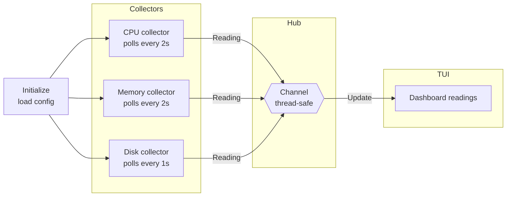

<pre>
██████╗ ██╗   ██╗██╗     ███████╗███████╗     █████╗  ██████╗ ███████╗███╗   ██╗████████╗
██╔══██╗██║   ██║██║     ██╔════╝██╔════╝    ██╔══██╗██╔════╝ ██╔════╝████╗  ██║╚══██╔══╝
██████╔╝██║   ██║██║     ███████╗█████╗      ███████║██║  ███╗█████╗  ██╔██╗ ██║   ██║   
██╔═══╝ ██║   ██║██║     ╚════██║██╔══╝      ██╔══██║██║   ██║██╔══╝  ██║╚██╗██║   ██║   
██║     ╚██████╔╝███████╗███████║███████╗    ██║  ██║╚██████╔╝███████╗██║ ╚████║   ██║   
╚═╝      ╚═════╝ ╚══════╝╚══════╝╚══════╝    ╚═╝  ╚═╝ ╚═════╝ ╚══════╝╚═╝  ╚═══╝   ╚═╝   
</pre>

> **Real-time system monitoring agent for Windows — built on Go's native concurrency primitives.**

---

Pulse-Agent is a lightweight system monitor that runs in your terminal and shows real-time CPU, memory, and disk usage. It updates live with progress bars and trend charts, and cleans up gracefully when you close it.

## Features

- **11 color themes** — Original, Catppuccin Mocha, Dracula, Nord, Gruvbox, Tokyo Night, One Dark Pro, GitHub Dark, Ayu Mirage, Monokai Pro, and Synthwave; switch live with the theme picker (`t`)
- **Persistent settings** — your theme preference is saved and restored automatically on next launch
- **Live stats** — CPU, memory, and disk are tracked independently with progress bars and 3-hour trend charts
- **Info panel** — press F1 to open a scrollable glossary explaining each metric
- **Quit confirmation** — press `q` for a safe quit prompt (Ctrl+C still quits instantly)
- **Works everywhere** — icons, borders, and charts adapt to your terminal's capabilities
- **Clean exit** — closing the app stops all background tasks before shutting down

## Requirements

| Requirement | Version |
|-------------|---------|
| Go | 1.21+ |
| Windows | 10 (build 10586+) |

## Documentation

| Doc | Description |
|-----|-------------|
| [SETUP](docs/setup.md) | Clone, install dependencies, build, and run |
| [TESTING](docs/tests.md) | How to run tests and what is covered |

## Architecture

## Key Components

### Metric data
Every collector produces a simple data package containing the metric name, value, and timestamp. The UI reads these packages and displays them as cards — adding a new metric only requires writing a new collector, with no changes needed in the UI.

### Channel hub
A built-in Go channel safely passes readings from the collectors to the UI. If the UI is busy, the collectors wait — no data is lost and no extra locking is needed.

### Collectors
CPU, memory, and disk each run on their own background worker with a timer. CPU and memory update every 2 seconds; disk updates every 1 second. All workers stop immediately when the app is asked to quit.

### Terminal UI
Three dashboard cards show CPU, memory, and disk usage with live progress bars and 3-hour trend history. An info panel (F1) explains each metric in detail.

### Theme system
Colors are defined as named palettes and applied globally. Eleven presets are included — Original, Catppuccin Mocha, Dracula, Nord, Gruvbox, Tokyo Night, One Dark Pro, GitHub Dark, Ayu Mirage, Monokai Pro, and Synthwave. Open the theme picker with `t` to browse and switch live — your choice is saved to disk and restored on the next launch. The active theme name is always visible in the footer.

### Terminal detection
On startup the app checks what your terminal supports and picks the best icons, borders, and chart symbols automatically. On basic terminals it falls back to simple ASCII characters so everything still looks clean.

### Graceful shutdown
When you press `q` or Ctrl+C, all background workers are told to stop, they finish their current task, and then the app closes. Nothing is left hanging.
