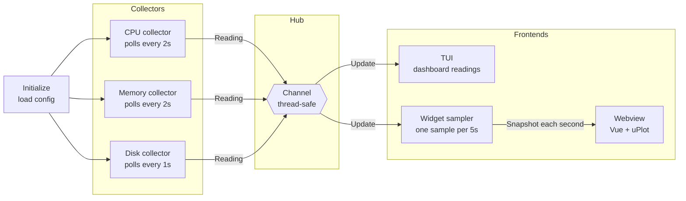

<div align="center">

<pre>
█████╗ ██╗   ██╗██╗     ███████╗███████╗     █████╗  ██████╗ ███████╗███╗   ██╗████████╗
██╔══██╗██║   ██║██║     ██╔════╝██╔════╝    ██╔══██╗██╔════╝ ██╔════╝████╗  ██║╚══██╔══╝
█████╔╝██║   ██╗██║     ███████╗█████╗      ███████║██║  ███╗█████╗  ██╔██╗ ██║   ██║   
██╔═══╝ ██║   ██╗██║     ╚════██║██╔══╝      ██╔══██║██║   ██║██╔══╝  ██║╚██╗██║   ██║   
██║     ╚██████╔╝███████╗███████║███████╗    ██║  ██║╚██████╔╝███████╗██║ ╚████║   ██║   
╚═╝      ╚═════╝ ╚══════╝╚══════╝╚══════╝    ╚═╝  ╚═╝ ╚═════╝ ╚══════╝╚═╝  ╚═══╝   ╚═╝   
</pre>

> **Real-time system monitoring agent for Windows**

[](https://go.dev/)
[](https://www.microsoft.com/windows)
[](LICENSE)

[](https://github.com/marksxiety/pulse-agent/actions/workflows/lint.yml)
[](https://github.com/marksxiety/pulse-agent/actions/workflows/tests.yml)
[](https://github.com/marksxiety/pulse-agent/actions/workflows/build.yml)

</div>

---


Pulse-Agent is a lightweight system monitor that runs in your terminal
and shows real-time CPU, memory, and disk usage. It updates live with
progress bars and trend charts, and cleans up gracefully when you close
it.

A Windows desktop widget ships alongside it, reusing the same collectors
and history model to show the same three metrics in a frameless,
always-on-top window you can park in a corner of your screen.

## Features

- **Theme selection** — browse and switch themes live with the theme
  picker (`t`)
- **Persistent settings** — your theme preference is saved and restored
  automatically on next launch
- **Live stats** — CPU, memory, and disk are tracked independently with
  progress bars and 3-hour trend charts
- **Info panel** — press F1 to open a scrollable glossary explaining
  each metric
- **Quit confirmation** — press `q` for a safe quit prompt (Ctrl+C
  still quits instantly)
- **Works everywhere** — icons, borders, and charts adapt to your
  terminal's capabilities
- **Clean exit** — closing the app stops all background tasks before
  shutting down

## Getting started

```powershell
# Terminal UI
go run ./agent

# Desktop widget (Windows)
cd desktop
wails dev
```

See [SETUP](docs/setup.md) for the full walkthrough. The widget needs
the Wails CLI and Node.js on top of Go.

## Desktop widget

A frameless, fixed-size, always-on-top window for Windows 10 and 11,
rendered in WebView2 via [Wails](https://wails.io) instead of a
terminal. It shows the same three metric cards, the same 3-hour trend
charts, and the same 11 themes as the TUI.

Both frontends share one config file, so a theme changed in either one
applies to the other on its next launch. Press `◉` to pin or unpin the
widget, `⬡` to change theme, and drag the top strip to move it.

See [desktop/README.md](desktop/README.md) for prerequisites, the
standalone build, and troubleshooting.

## Architecture



## Key Components

### Metric data

Every collector produces a simple data package containing the metric
name, value, and timestamp. The UI reads these packages and displays
them as cards — adding a new metric only requires writing a new
collector, with no changes needed in the UI.

### Channel hub

A built-in Go channel safely passes readings from the collectors to the
frontends. If a frontend is busy, the collectors wait — no data is lost
and no extra locking is needed.

### Collectors

CPU, memory, and disk each run on their own background worker with a
timer. CPU and memory update every 2 seconds; disk updates every 1
second. All workers stop immediately when the app is asked to quit.

### Terminal UI

Three dashboard cards show CPU, memory, and disk usage with live
progress bars and 3-hour trend history. An info panel (F1) explains
each metric in detail.

### Desktop widget

The same collectors feed a sampler that records one reading every 5
seconds — 2160 samples, the same 3-hour window the TUI shows. Once a
second the backend pushes a snapshot to the webview: current values plus
a trend downsampled to 120 points.

It pushes rather than letting the frontend poll, because WebView2
throttles timers while the window is occluded, which is exactly when a
widget is normally hidden.

### Theme system

Colors are defined as named palettes and applied globally. Open the
theme picker with `t` to browse and switch live — your choice is saved
to disk and restored on the next launch. The active theme name is always
visible in the footer.

### Terminal detection

On startup the app checks what your terminal supports and picks the best
icons, borders, and chart symbols automatically. On basic terminals it
falls back to simple ASCII characters so everything still looks clean.

### Graceful shutdown

When you press `q` or Ctrl+C, all background workers are told to stop,
they finish their current task, and then the app closes. Nothing is
left hanging.

## Requirements

| Requirement | Version        |
|-------------|----------------|
| Go          | 1.26.1+        |
| Windows     | 10 (10586+)    |

The desktop widget is Windows-only and additionally needs the Wails CLI,
Node.js, and the WebView2 runtime — see
[desktop/README.md](desktop/README.md).

## Documentation

| Docs                          | Description                                   |
|-------------------------------|-----------------------------------------------|
| [SETUP](docs/setup.md)        | Clone, install dependencies, build, and run   |
| [TESTING](docs/tests.md)      | How to run tests and what is covered          |
| [DESKTOP](desktop/README.md)  | Desktop widget: prerequisites, build, notes   |
