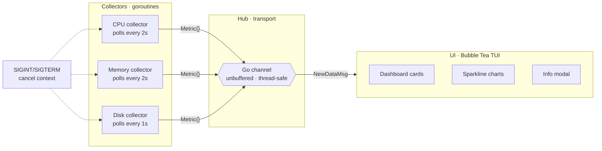

# Pulse-Agent

A high-performance, concurrent system monitoring agent built with Go. Pulse-Agent demonstrates Go's native concurrency primitives for real-time observability — independent goroutines, a shared channel hub, and a single-threaded consumer.

## Overview

Pulse-Agent is a lightweight heartbeat agent. Independent goroutines poll the OS for hardware metrics and stream them through a Go channel to a Bubble Tea terminal UI. Each collector runs its own polling loop with context-based cancellation for graceful shutdown.

## Documentation

| Doc | Description |
|-----|-------------|
| [Setup](docs/setup.md) | Clone, install dependencies, build, and run |
| [Testing](docs/tests.md) | How to run tests and what's covered |

## Architecture

### Key components

- **`Metric` struct** — A unified contract for all data points. Every collector produces one; the UI reads one.
- **Go channel (hub)** — An unbuffered, thread-safe pipe between producers and consumer. Eliminates data races without explicit locking.
- **Collectors** — Each collector runs its own polling loop using `time.Sleep` and `context.Done()` for cancellation. CPU and Memory poll every 2s, Disk every 1s.
- **Bubble Tea UI** — The consumer renders three cards (CPU, Memory, Disk) with progress bars, 3-hour sparkline trends, and a scrollable info modal.
- **Graceful shutdown** — SIGINT/SIGTERM triggers context cancellation, waits for all collectors to stop via `sync.WaitGroup`, then closes the channel and quits the UI.