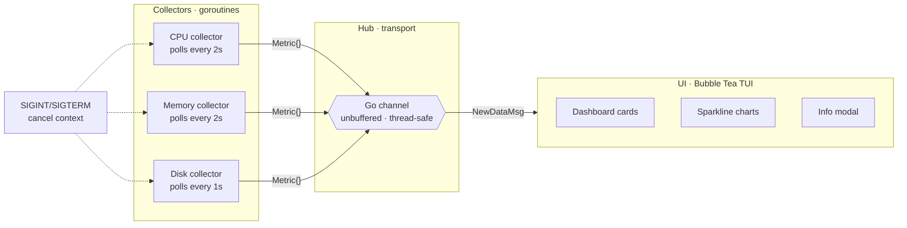

<pre>
██████╗ ██╗   ██╗██╗     ███████╗███████╗     █████╗  ██████╗ ███████╗███╗   ██╗████████╗
██╔══██╗██║   ██║██║     ██╔════╝██╔════╝    ██╔══██╗██╔════╝ ██╔════╝████╗  ██║╚══██╔══╝
██████╔╝██║   ██║██║     ███████╗█████╗      ███████║██║  ███╗█████╗  ██╔██╗ ██║   ██║   
██╔═══╝ ██║   ██║██║     ╚════██║██╔══╝      ██╔══██║██║   ██║██╔══╝  ██║╚██╗██║   ██║   
██║     ╚██████╔╝███████╗███████║███████╗    ██║  ██║╚██████╔╝███████╗██║ ╚████║   ██║   
╚═╝      ╚═════╝ ╚══════╝╚══════╝╚══════╝    ╚═╝  ╚═╝ ╚═════╝ ╚══════╝╚═╝  ╚═══╝   ╚═╝   
</pre>

> **Real-time system monitoring agent for Windows — built on Go's native concurrency primitives.**

---

Pulse-Agent is a lightweight, high-performance heartbeat agent that polls OS hardware metrics and streams them in real time to a terminal UI. Independent goroutines collect CPU, memory, and disk data; a shared channel hub delivers every reading to a single-threaded consumer with no explicit locking.

## Features

- **Concurrent collectors** — CPU, memory, and disk each run in their own goroutine with independent polling intervals
- **Lock-free transport** — an unbuffered Go channel eliminates data races between producers and consumer
- **Live terminal UI** — progress bars, 3-hour sparkline trends, and a scrollable info modal via Bubble Tea
- **Graceful shutdown** — SIGINT/SIGTERM triggers context cancellation; a WaitGroup waits for all collectors before teardown

## Requirements

| Requirement | Version |
|-------------|---------|
| Go | 1.21+ |
| Windows | 10 (build 10586+) |

## Documentation

| Doc | Description |
|-----|-------------|
| [SETUP](docs/setup.md) | Clone, install dependencies, build, and run |
| [TESTING](docs/tests.md) | How to run tests and what is covered |

## Architecture

## Key Components

### Metric struct
A unified data contract shared across the entire pipeline. Every collector produces one; the UI consumes one. Keeping this boundary explicit makes it straightforward to add new collectors without touching the UI layer.

### Channel hub
An unbuffered, thread-safe Go channel connects producers to the consumer. Backpressure is natural — a collector blocks until the UI is ready — and there is no need for mutexes or shared state.

### Collectors
Each collector is an independent goroutine running its own polling loop with context-based cancellation. CPU and memory fire every 2 seconds; disk fires every 1 second. All three stop cleanly on shutdown.

### Bubble Tea UI
The single consumer renders three dashboard cards (CPU, Memory, Disk) with live progress bars, 3-hour sparkline history, and a scrollable info modal.

### Graceful shutdown
On SIGINT or SIGTERM, the root context is cancelled. Each collector exits its loop, the WaitGroup drains, the channel closes, and the UI quits — in that order, every time.

## Contributing

Pull requests are welcome. Please open an issue first to discuss significant changes.

## License

[MIT](LICENSE)