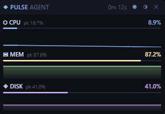

# Pulse Agent — Desktop Widget

A frameless, fixed-size, always-on-top desktop widget that shows live CPU,
memory, and disk usage with 3-hour trend charts. It runs alongside the terminal
UI and shares the same collectors, history model, and theme palettes.



| | |
|---|---|
| **Platform** | Windows 10 / 11 (x64) |
| **Runtime** | WebView2 |
| **Stack** | Go + Wails v2 + Vue 3 + uPlot |

---

## Quick start

Everything below runs from the `desktop/` directory.

```powershell
cd desktop

# Development: hot-reload frontend, live Go rebuilds
wails dev

# Production build
wails build

# Run the built widget
.\build\bin\desktop.exe
```

`wails dev` opens the widget window and watches both the Go and frontend source.
Frontend edits hot-reload instantly; Go edits trigger a rebuild and relaunch.

While `wails dev` is running you can also work in a browser, where the bound Go
methods are callable from devtools:

```
http://localhost:34115
```

---

## Prerequisites

| Requirement | Version | Notes |
|---|---|---|
| Go | 1.26.1+ | `go.mod` declares 1.26.1 |
| Wails CLI | v2.16.0 | `go install github.com/wailsapp/wails/v2/cmd/wails@latest` |
| Node.js | 22+ | Vite 7 frontend build |
| WebView2 Runtime | any recent | Preinstalled on Windows 11 and most Windows 10 |

Install the Wails CLI and confirm the environment:

```powershell
go install github.com/wailsapp/wails/v2/cmd/wails@latest
wails doctor
```

Both `C:\Program Files\Go\bin` (the toolchain) and `%USERPROFILE%\go\bin` (the
Wails CLI) are added to `PATH` at install time. If a terminal still cannot find
`wails`, it was opened before the install — restart it. To patch the current
session instead:

```powershell
$env:PATH += ";$env:USERPROFILE\go\bin"
```

---

## Using the widget

The window is frameless, so there is no OS title bar, and its size is fixed.

| Action | How |
|---|---|
| Move | Drag the top strip of the widget |
| Pin / unpin from top | The ◉ button |
| Change theme | The ⬡ button |
| Close | The ✕ button |

The widget cannot be resized — it is meant to be parked and left alone, and a
fixed frame keeps the three cards from reflowing. A saved size is still
honoured, it just cannot be dragged afterwards.

It restores its position on next launch, and places itself in the top-right
corner of the primary display on first run.

### Themes

All 11 palettes are shared with the terminal UI. Changing the theme here also
changes it for the TUI on its next launch, because both read the same config
file.

### Config file

`%USERPROFILE%\.pulse-agent\config.yaml` — written by both frontends.

```yaml
theme: original
window_x: 1556
window_y: 24
window_width: 340
window_height: 236
always_on_top: true
```

Deleting this file resets everything, including the window position. That is the
fix if the widget ever ends up off-screen (for example after disconnecting the
monitor it was parked on).

---

## How it works

The widget reuses the terminal UI's data layer unchanged. Only the presentation
layer differs.

```
collector/ ──► channel hub ──► App.apply()      MetricHistory (2160 samples)
                                        │
                                        │ every 1s, downsampled to 120 points
                                        ▼
                        runtime.EventsEmit("pulse:snapshot")
                                        │
                                        ▼
                              Vue 3 + uPlot (webview)
```

- **Collectors** run as three goroutines, exactly as in the TUI. CPU and memory
  poll every 2s, disk every 1s.
- **History** is sampled every 5s into the shared `models.MetricHistory`, giving
  `2160 × 5s = 3 hours` of trend — the same window the TUI shows.
- **`Downsample(120)`** runs in Go before emitting. Shipping all 2160 raw samples
  every second would be wasteful; the chart cannot resolve that many points
  anyway.
- **Push, not pull.** The backend emits an event every second. The frontend does
  not poll with `setInterval`, because WebView2 throttles timers when the window
  is occluded — which is exactly when a widget is normally hidden.

### Bound methods

| Method | Purpose |
|---|---|
| `GetBootstrap()` | Themes, active theme, version, pin state |
| `SetTheme(name)` | Persist a theme, returns the applied palette |
| `SetAlwaysOnTop(bool)` | Pin/unpin and persist |
| `Quit()` | Save window state and exit |

Generated bindings live in `frontend/wailsjs/` and are regenerated by every
`wails build` and `wails dev`. Do not edit them by hand.

---

## Project layout

```
desktop/
├── main.go            window options, embed, Wails bootstrap
├── app.go             collectors, event pump, bound methods
├── screen.go          Win32 screen metrics for first-run placement
├── wails.json         Wails project config
├── build/             icons, manifests, NSIS installer
└── frontend/
    ├── src/
    │   ├── App.vue
    │   ├── components/{MetricCard,TrendChart,ThemePicker}.vue
    │   ├── types.ts   mirrors the Go payload structs
    │   └── format.ts
    └── dist/          build output + tracked `gitkeep`
```

The shared `collector/`, `models/`, `theme/`, `types/`, and `utils/` packages
live at the repository root and are used by both frontends.

---

## Building a release

```powershell
wails build            # desktop/build/bin/desktop.exe
wails build -clean     # wipe build/bin first
wails build -nsis      # also produce a Windows installer (requires NSIS)
wails build -debug     # devtools enabled
```

---

## Notes for contributors

### Windows-only build constraint

Every `.go` file in this package carries `//go:build windows`. This is load
bearing: it keeps the package out of the module graph on Linux and macOS, so the
CI lint and test jobs on `ubuntu-latest` do not try to build Wails' Linux
backend and fail on missing GTK headers.

A side effect is that `go build ./...` on Linux silently skips this package
while compiling everything else. That is intended.

### Why `emptyOutDir: false`

`main.go` uses `//go:embed all:frontend/dist`, so `frontend/dist` must contain
at least one file for the package to compile. Vite wipes its output directory by
default, which would delete the tracked `frontend/dist/gitkeep` and break
`go build ./...` on a fresh clone. `vite.config.ts` disables that behaviour to
keep the placeholder alive.

Do not remove `frontend/dist/gitkeep`, and do not re-enable `emptyOutDir`.

### Why the frame is fixed

`DisableResize: true` is deliberate: the widget is not meant to be resized, and
a fixed frame keeps the three cards from reflowing mid-glance. The window
options are built by `widgetOptions` rather than inline in `main`, so
`desktop/main_test.go` can assert the whole contract — including this flag.

---

## Troubleshooting

**The widget is invisible or off-screen**
Delete `%USERPROFILE%\.pulse-agent\config.yaml` and relaunch. It will return to
the top-right of the primary display.

**The window flickers or has a white halo around the corners**
The widget relies on WebView2 transparency. On some GPU/driver combinations the
fix is to disable webview GPU acceleration — set `WebviewGpuIsDisabled: true` in
the `windows.Options` block of `main.go`.

**There is no drop shadow**
`DisableFramelessWindowDecorations: true` in `main.go` disables the DWM-drawn
shadow so the CSS card owns its corners. Set it to `false` to get the shadow
back, at the cost of DWM drawing its own rounded rect.

**Want a blur behind the widget?**
Windows 11 build 22621+ supports it: set `BackdropType: windows.Acrylic` in the
`windows.Options` block of `main.go`.

**`go build ./...` fails with `pattern all:frontend/dist: no matching files`**
`frontend/dist` is empty. Either restore the tracked `gitkeep` (see above) or run
the frontend build once:

```powershell
cd frontend
npm install
npm run build
```

---

## Terminal UI

The widget is an addition, not a replacement. The TUI is unaffected and runs
from the repository root:

```powershell
go run ./agent
```

Run the shared test suite with:

```powershell
go test ./...
```

See the repository root `README.md` for TUI documentation.
